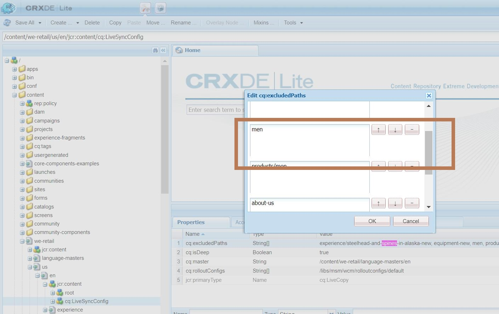

# AEM: Använda en borttagen Live Copy

Om du tar bort en Live Copy-sida i Adobe Experience Manager utan att frigöra den, utesluts sidan från utrullning. I den här artikeln beskrivs hur du tar med sidan i utrullningen en gång till.

## Beskrivning {#description}

### <b>Miljö</b>

- Adobe Experience Manager (AEM)
- AEM 6.5

### <b>Problem/symtom</b>

Om du tar bort en Live Copy-sida utan att frigöra den utesluts den från utrullning.

## Upplösning {#resolution}

En rotsida i Live Copy har följande &#x200B; &#x200B; för att utesluta utrullning.

<b>Nod:</b> <b>{root of Live Copy Page}/jcr:content/cq:LiveSyncConfig Properties: cq:excludePaths (String`[` `]` )</b>

Ta bort en Live Copy-sida utan att använda <b>Koppla loss</b> om du väljer det här alternativet läggs sidnamnet till i en egenskap, vilket utesluter det från utrullningen. Om du vill ta med den borttagna sidan i utrullningen måste du därför ta bort sidnamnet från egenskapen.

<b>Exempel:</b>
Om följande sida finns på *Vi-butik* tas bort före Koppla loss, sedan *män* läggs till i <b>cq:excludePaths </b>egenskapsvärde i Live Sync-inställningar.
Du kan inkludera sidan i utrullningen av sidan genom att gå till CRX/DE Lite och ta bort &quot;men&quot; från<b> cq:excludePaths.</b>

Borttagen sida:<b>/content/we-retail/us/en/men </b>
Live Copy of root page:<b>/content/we-retail/us/en</b>
Inställningar för Live Sync:<b>/content/we-retail/us/en/jcr:content/cq:LiveSyncConfig</b>

