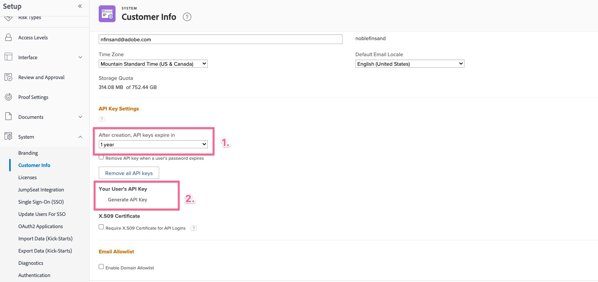

# Felaktig begäran vid konfiguration av tillägget Workfront för Jira

Ett felaktigt begärandefel visas när du försöker upprätta en anslutning mellan Workfront och Jira. Så här löser du problemet genom att kontrollera om API-nyckeln finns och har förfallodatumet i <b>API-nyckelinställningar</b> i Workfront.

## Beskrivning {#description}

### <b>Miljö</b>

Workfront

### <b>Problem/symtom</b>

Det finns ett felaktigt begärandefel när du försöker upprätta en anslutning mellan Workfront och Jira när det inte finns någon giltig API-nyckel i Workfront för användaren.

## Upplösning {#resolution}

<b>Steg som ska åtgärdas:</b>
1. Logga in på <b>Workfront</b>vill du upprätta anslutningen med som användare.
2. Navigera till <b>Inställningar</b>.
   - Gå till <b>System</b> `>`  <b>Kundinformation</b> i <b>Workfront</b>.
   - Kontrollera om en *API-nyckel* finns i <b>API-nyckelinställningar</b> -avsnitt.
3. Om en *API-nyckel* finns inte:
   - Ange ett förfallodatum och klicka på <b>Generera</b>.
4. Om det redan finns en API-nyckel:
   - Verifiera längden på den tid som angetts före *tangenten förfaller* och klicka <b>Återställ</b>.
5. Gå till <b>Jira</b> och försök ansluta igen <b>Workfront</b>.

### <b>Relevanta länkar:</b>

- [Konfigurera Adobe Workfront för Jira](https://experienceleague.adobe.com/docs/workfront/using/adobe-workfront-integrations/workfront-for-jira/configure-workfront-for-jira.html?lang=en)
- [Hantera API-nycklar i Workfront](https://experienceleague.adobe.com/docs/workfront/using/administration-and-setup/manage-wf/security/manage-api-keys.html?lang=en)
