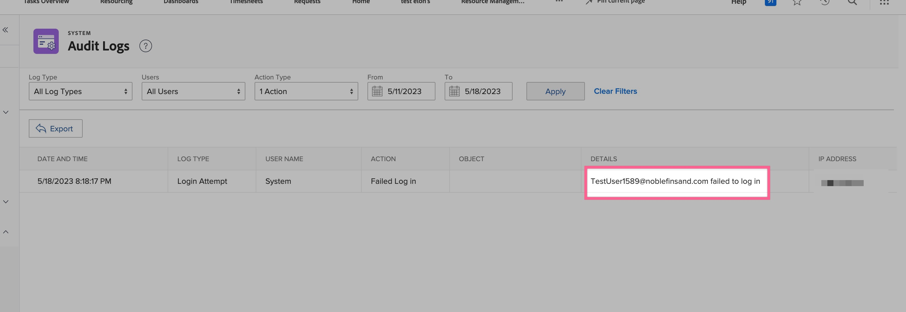

# Inloggningsfel eftersom användaren inte är kopplad till enkel inloggning (enkel inloggning)

Du löser inloggningsfelet genom att kontrollera det Federations-ID som anges i Workfront-kontot och använda granskningsloggarna som felsökningsverktyg.

## Beskrivning {#description}

### Miljö

Workfront

### Problem/symtom

När du försöker logga in via Workfront med enkel inloggning (SSO) dirigeras sidan om till Workfront inloggningssida. I webbadressfältet på inloggningssidan visas ett felmeddelande om att användaren inte är mappad.

## Upplösning {#resolution}

1. Navigera till den specifika användare som får det här felet i Workfront:
   - [Redigera användare](https://experienceleague.adobe.com/docs/workfront/using/administration-and-setup/add-users/create-manage-users/edit-a-users-profile.html?lang=en).
   - Om det inte finns något användarkonto [skapa en ny användare](https://experienceleague.adobe.com/docs/workfront/using/administration-and-setup/add-users/create-manage-users/add-users.html?lang=en) konto.
2. Kontrollera att användaren har ett Federation ID i listan:
   - Sök efter Federations-ID.
3. Om Federations-ID:t är tomt gör du så här:
   - Ange användarens Federations-ID (skiftlägeskänsligt) som tillhandahålls av din identitetsleverantör.
   - Klicka <b>Spara.</b>
   - Obs! Federations-ID är skiftlägeskänsligt och måste matcha exakt hur det skickas till Workfront från din identitetsleverantör. Om du är osäker på Federations-ID:t eller dess skiftlägeskänslighet kontaktar du nätverks- eller IT-administratören.
   - Kontrollera också om det finns några extra blanksteg före eller efter Federations-ID, eftersom de kan vara orsaken till felet.

Valfria steg: Granskningsloggar

Använd granskningsloggarna i Workfront som ett felsökningsverktyg för att undersöka vad din identitetsleverantör skickar som Federations-ID (namn-ID) under det misslyckade inloggningsförsöket.

1. Klicka på <b>Inställningar</b>
2. Gå till System `>`  [Granskningsloggar](https://experienceleague.adobe.com/docs/workfront/using/administration-and-setup/add-users/create-manage-users/audit-logs.html?lang=en)
3. Använd filter för att visa misslyckade inloggningsförsök
   - Filtrera ned till misslyckade inloggningsförsök 
   - Klicka <b>Använd</b>.
4. Federations-ID (namn-ID) som skickas från identitetsleverantören till Workfront visas i detaljkolumnen för det nyligen misslyckade inloggningsförsöket.
   - Kontrollera att det Federations-ID som visas i detaljkolumnen matchar exakt (skiftlägeskänsligt) det som anges i Workfront som Federations-ID.
