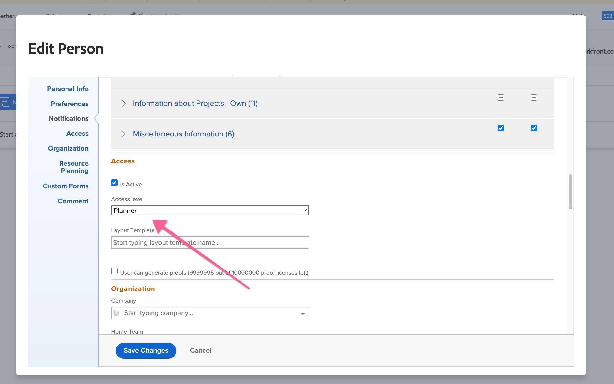

# Korrekturproblem vid överföring av korrektur, bläddring i blått fält i oändlighet

För att lösa problemet där det blå fältet rullar i oändlighet när användaren överför korrektur bör administratören ändra användarens åtkomstnivå till *Granskare* i Workfront.

## Beskrivning {#description}

### Miljö

Workfront

### Problem/symtom

När ett nytt korrektur överförs visar avsnittet Lägg till nytt korrektur ett blått fält som rullar över skärmen i oändlighet.

## Upplösning {#resolution}

1. Klicka på <b>Systemadministratör</b> `>`  <b>Inställningar </b>`>` <b>Logga in som </b>`>`  (logga in som användare).
2. Gå till <b>fliken dokument </b>för att överföra ett nytt dokument.
3. <b>Skapa ett nytt korrektur</b> som användaren och se om detta är reproducerbart.
4. Om detta fortfarande är ett problem,<b> utloggning </b>när användaren går tillbaka till administratörsåtkomsten igen.
5. Öppna <b>användarprofil</b>. Användaren finns i *Användarlista* eller genom att gå till sökområdet och söka efter användaren och markera dem.
6. Redigera <b>användarens konto.</b>
7. Bläddra nedåt till <b>åtkomstnivå för användare</b> i Workfront och skriv ned den angivna informationen <b></b>
8. Ändra <b>åtkomstnivå för användare</b> till *Granskare* och *Spara.*
9. Gå tillbaka till användarens redigeringssida och <b>ändra åtkomstnivå</b> tillbaka till det som användaren ursprungligen hade.
