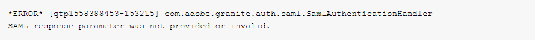

# SAML-fel - SAML-svarsparametern har inte angetts eller är ogiltig

## Beskrivning {#description}

### Miljö

Adobe Experience Manager

### Problem/symtom

När du skapade SAML 2.0-konfigurationen för att aktivera SSO-inloggning på författaren till produktionen fick du ett felmeddelande från AEM. Detta skedde efter att Azure-providern utförde inloggningen och hämtade SAML-token för att utföra autentiseringen på AEM.

Följande fel har tagits emot:

## Upplösning {#resolution}

När du har verifierat SAML-konfigurationen observerades det att när du försöker logga in AEM författare får du felmeddelandet 403.

Fel 403 visas vanligtvis om referensfiltret för Apache Sling inte är aktiverat. När konfigurationen för referensfiltret för Apache Sling kontrollerades upptäcktes att <b>Tillåt tomma</b> alternativet kontrollerades inte och ingen värd lades till i <b>Tillåt värdar</b>.

För att SAML-inloggningen ska fungera måste identitetsleverantörens värdnamn läggas till i OSGi-konfigurationen för Apache Sling Referrer-filtret.

Kontrollera därför <b>Tillåt tomt</b>och lägg till värdarna som representerar IdP-providern i <b>Tillåt värdar</b>.

När du har slutfört dessa obligatoriska steg slutfördes inloggningen.

<b>Anteckning</b>: IDP-URL:en måste läggas till i konfigurationen för Apache Sling Referrer-filtret utan att till exempel inkludera protokollet `aem-sso-saml` i stället för `https://aem-sso-saml`
