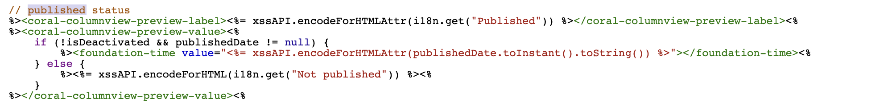

# Adobe Experience Manager: Anpassa visningsformatet för det publicerade datumet på webbplatskonsolen

## Beskrivning {#description}

AEM Sidans publiceringsdatum visas i webbplatskonsolen, men tidpunkten på dagen visas inte.
I det här avsnittet beskrivs hur du anpassar datum-/tidsformatet för det publicerade datumet så att det inkluderar tidpunkten för dagen.

<b>Miljö</b>
AEM 6.5, AEM as a Cloud Service

## Upplösning {#resolution}

Skapa en övertäckning för varje kolumn- och listvy.

I kolumnvyn är /libs/cq/gui/components/coral/admin/page/columnpreview/columnpreview.jsp överlappad.
  Före

Efter: Lägg till type=&quot;datetime&quot;-attributet i taggen Foundation-time.

I listvyn är /libs/cq/gui/components/coral/admin/page/row/row.jsp överlagrad.
  Före

Efter: Lägg till type=&quot;datetime&quot;-attributet i taggen Foundation-time.

