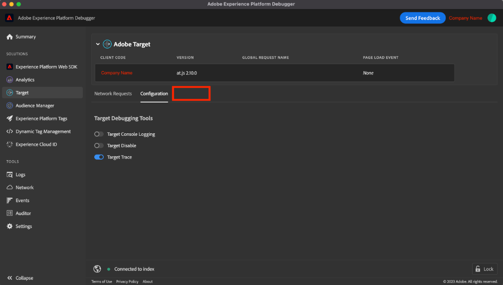

# &quot;Målspår&quot; visas inte i Adobe Experience Platform Debugger

If <b>Målspår </b>visas inte i AEP Debugger, kontrollera att du loggar in på en organisation där Adobe Target används och aktiverar <b>Målspårning </b>växla.

## Beskrivning {#description}

### Miljö

- Adobe Experience Platform
- Adobe Target

### Problem/symtom

The <b>Målspår</b> visas inte i Adobe Experience Platform Debugger.

## Upplösning {#resolution}

Kontrollera följande villkor först:

- Användaren måste logga in på en organisation där Adobe Target används på webbplatsen.
- The <b>Målspårning</b> växla till <b>Mål</b> `>`  <b>Konfiguration</b> `>`  <b>Målverktyg för felsökning</b> -avsnittet måste vara aktiverat.

Om problemet kvarstår trots ovanstående villkor kan du försöka med följande steg nedan.

- Skapa en ny webbläsarprofil

  <u>I Chrome-webbläsaren</u>:

   1. Klicka på profilikonen i det övre högra hörnet och klicka sedan på <b>Lägg till</b>.
   2. Installera tillägget Adobe Experience Platform Debugger för den nya profilen.
- Återställ webbläsarinställningarna till standardinställningarna

  <u>I Chrome-webbläsaren</u>:

   1. Överst till höger väljer du <b>Mer</b> ikonen och sedan gå till <b>Inställningar</b>.
   2. Välj <b>Återställ inställningar</b> `>`  <b>Återställ inställningarna till deras ursprungliga standard</b> `>`  <b>Återställ inställningar</b>.
   3. När inställningarna har återställts aktiverar du tillägget Adobe Experience Platform Debugger igen.
