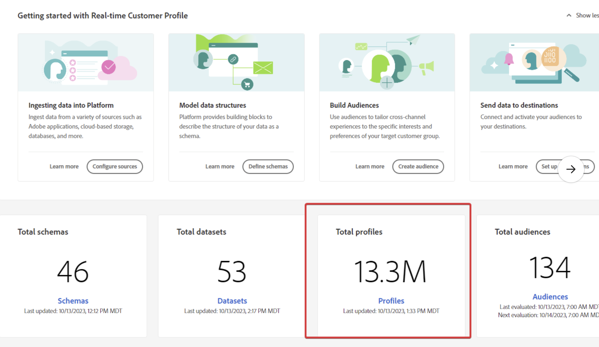

# AEP - Den adresserbara målgruppen i licensanvändningsavsnittet matchar inte antalet profiler från startsidan

Den adresserbara målgruppen i licensanvändningsavsnittet matchar inte antalet profiler från startsidan.

## Beskrivning {#description}

När du är i Experience Platform kan du se olika siffror på olika ställen, som:           Totalt antal profiler på startsidan:             Mottagande målgrupp inom licensanvändning:     

## Upplösning {#resolution}

Observera att beräkningen för adresserbar målgrupp skiljer sig från det totala antalet profiler.

Den adresserbara publiken är den profil som finns i dess butik <u>oavsett</u> för alla sammanslagningsprinciper, medan det vi visar på en kontrollpanel (till exempel rutan Total profil på hemsidan) är profilen baserad på standardsammanslagningsprincipen.
