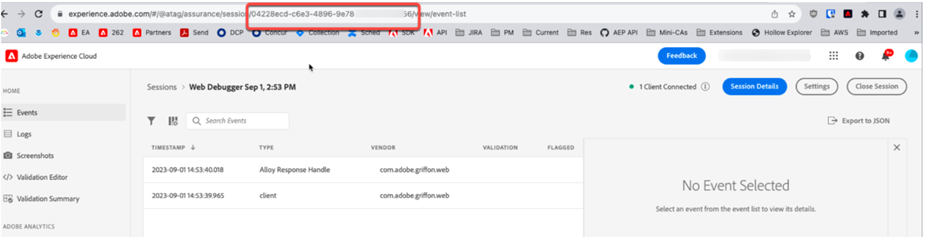

# Hur kan utvecklare visa försäkringsloggar via API


Artikeln beskriver hur utvecklare kan visa Assurance-loggarna via API.

## Beskrivning {#description}


### Miljö

Adobe Experience Platform Assurance

### Problem/symtom

Hur kan utvecklarteamet visa Assurance-loggarna via API?


## Upplösning {#resolution}


Följ de här stegen för att utföra denna begäran:

1. Logga in på Assurance med [den här länken](https://experience.adobe.com/assurance).
2. Hämta säkrings-ID från URL:en som visas nedan:

   
3. Använd följande Curl-begäran för att skicka API-begäran. Ersätt `ASSURANCE_ID` parameter med det säkerhets-ID som anges ovan.<br>


   ```
   curl --location --request POST 'https://server.adobedc.net/ee/v2/interact?dataStreamId= <YOUR_DATASTREAM_ID>&debugSessionId=<ASSURANCE_ID>'
   ```


4. API-svaret kommer att innehålla Assurance-loggarna.


Kontakta kundtjänst om du har ytterligare frågor.
