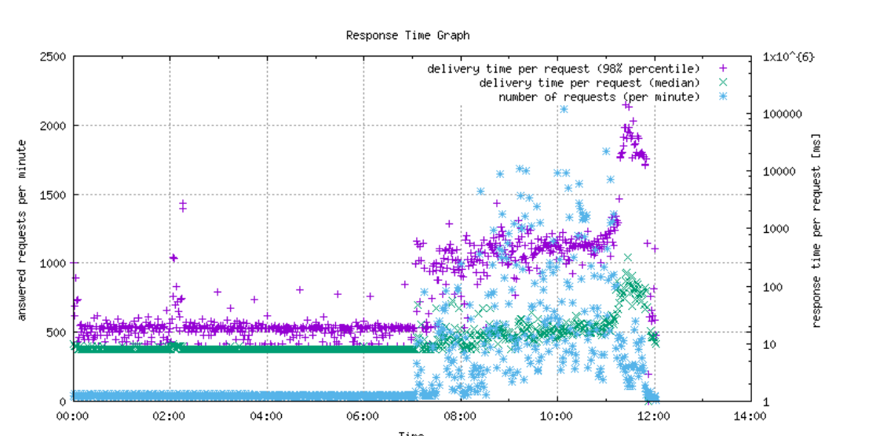

# Analyserar filen request.log för trafikmönster

I följande steg visas hur du analyserar `request.log` genom att generera ett trafikdiagram och sedan generera korsreferenser till utdata från `request.log` och `rlog.jar` verktyg.

## Beskrivning {#description}

### <b>Miljö</b>

Adobe Experience Manager

### <b>Problem/symtom</b>

Analysera `request.log` fil för trafikmönster?

## Upplösning {#resolution}

1. Installera <b>Perl </b>(Programmeringsspråk för textredigering) och <b>Gnuplot </b>(bärbar kommandorad) på datorn och för Windows OS, installera <b>Cygwin </b>(Unix-liknande miljö och kommandoradsgränssnitt).

   Vid installation <b>Cygwin</b>, var noga med att inkludera <b>Perl </b>och<b> Gnuplot</b> under installationen i <b>Välj paket </b>steg. På Mac OS(X) installerar du <b>Bra </b>(kostnadsfritt system för programpakethantering med öppen källkod).

   Efter installation <b>Bra</b>öppnar du Mac Terminal och kör <b>Bra </b>för installation <b>Gnuplot</b>.
2. Hämta de två följande filerna till en ny mapp på datorn.

   [graph-request-log.pl](https://raw.githubusercontent.com/joerghoh/cq5-utils/master/scripts/request.log/graph-request-log.pl)

   [requestedLog.pm](https://raw.githubusercontent.com/joerghoh/cq5-utils/master/scripts/request.log/requestlog.pm)
3. Kör kommandot för sökvägen till `request.log`: <b> </b>

   `Perl and graph-request-log.pl --title Request Log Graph --output output.png request.log | Gnuplot`.

   Kommandot skapar en fil med namnet `output.png` liknar följande:

För att förstå diagrammet ovan måste man förstå vad [median](https://www.mathsisfun.com/definitions/median.html) och [percentil](https://www.mathsisfun.com/data/percentiles.html) menar. Som framgår av diagrammet använder inte användarna systemet förrän vid ungefär 7:00. Trafiken stiger upp runt nio. Trafiken ökar sedan ytterligare kl. 11.30 och antalet förfrågningar ökar och svarstiderna blir långsammare (vilket framgår av mediansvarstiden och 98:e percentilmarkeringarna). Visa [Viktigt-fil](https://github.com/joerghoh/cq5-utils/tree/master/scripts/request.log) om du vill ha mer information om dokumentationen för det här diagramverktyget.

1. Nu när diagrammet har använts för att hitta viktiga tidsperioder, korsrefererar du de valda tidpunkterna i loggfilerna (till exempel request.log och error.log). Ett enkelt sätt att visa stora filer är att använda <b>[mindre](https://ja.wikipedia.org/wiki/Less_%28Unix%29)</b>på skalet (Cygwin i Windows eller Terminal i Mac). Kör till exempel det här kommandot <b>less request.log</b> och söka efter <b>/2016 11:3`[` 0-9`]` :</b>och tryck <b>Retur</b> för att välja tidsram till 11.30 i filen och sedan klicka på Sök. 
2. En korsreferens i diagrammen mot resultatet av `rlog.jar` program som levereras med AEM under opt/help kan också utföras. Instruktioner finns i [AEM dokument.](https://experienceleague.adobe.com/en/docs/experience-manager-release-information/aem-release-updates/previous-updates/aem-previous-versions)

