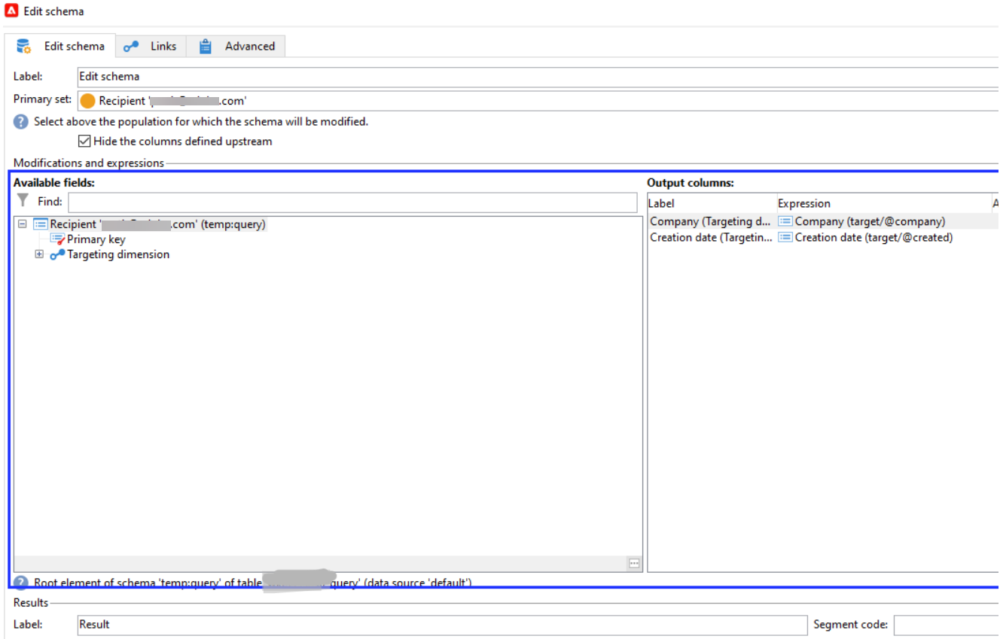
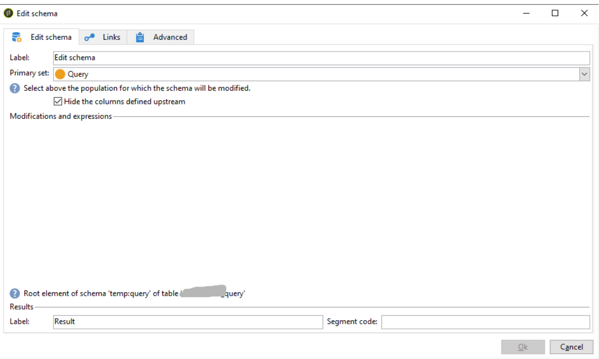

# Avsnittet Ändra och uttryck saknas i aktiviteten Redigera schema

I ADOBE CAMPAIGN CLASSIC *Ändringar och uttryck* -avsnittet saknas i *Redigera schema* bör du ta bort registret och rensa din lokala cache. Lös problemet genom att följa stegen som anges i den här artikeln.

## Beskrivning {#description}

### Miljö

Adobe Campaign Classic

### Problem/symtom

The *Modifiering och uttryck*-avsnittet saknas när aktiviteten Redigera schema läggs till i ett arbetsflöde.

<b>Steg som ska återskapas</b>:

1. Skapa ett arbetsflöde (wkf) och lägga till ett *Redigera schema* aktivitet.
2. Öppna den här aktiviteten och välj en *Primär* set.
3. Observera att <b>Ändringar och uttryck</b> -avsnittet saknas i redigeringsschemat.

Redigera schema med *Ändringar och uttryck*:

Redigera schema utan *Ändringar och uttryck*:

## Upplösning {#resolution}

Så här löser du problemet:

1. Ta bort registret.
   - Öppna registret genom att skriva <b>Register</b> i sökfältet.
   - Öppna <b>Registereditorn</b>.
   - Sök `Computer\HKEY_CURRENT_USER\SOFTWARE\Neolane`och ta bort allt innehåll från mappen Neolane.
2. Rensa din lokala cache från `C:\Users<user>\AppData\Roaming\Neolane\NL_5`. <b>Obs! </b>Ta inte bort `nlclient_cnx.xml`-fil.
   - Gå till följande platser beroende på vilken version av operativsystemet du har:
      - Windows 7: `C:\Users< Username >\AppData\Roaming\Neolane\NL_5\`
      - Windows XP: `C:\Documents and Settings< Username >\Application Data\Neolane\NL_5`
   - Här ser du många XML-filer `nlclient-config-< alphanumerical value >.xml`. Ta bort dessa XML-filer och associerade mappar, men ta inte bort `nlclient_cnx.xml` -fil.

### Relaterade avläsningar

[Så här utför du rensning av hårddiskcache när problemen är datorspecifika eller användarspecifika](https://experienceleague.adobe.com/en/docs/campaign-classic/using/getting-started/starting-with-adobe-campaign/faq/faq-campaign-config#perform-hard-cache-clear)i Campaign Classic v7-dokumentation.

